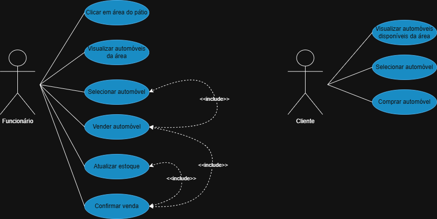
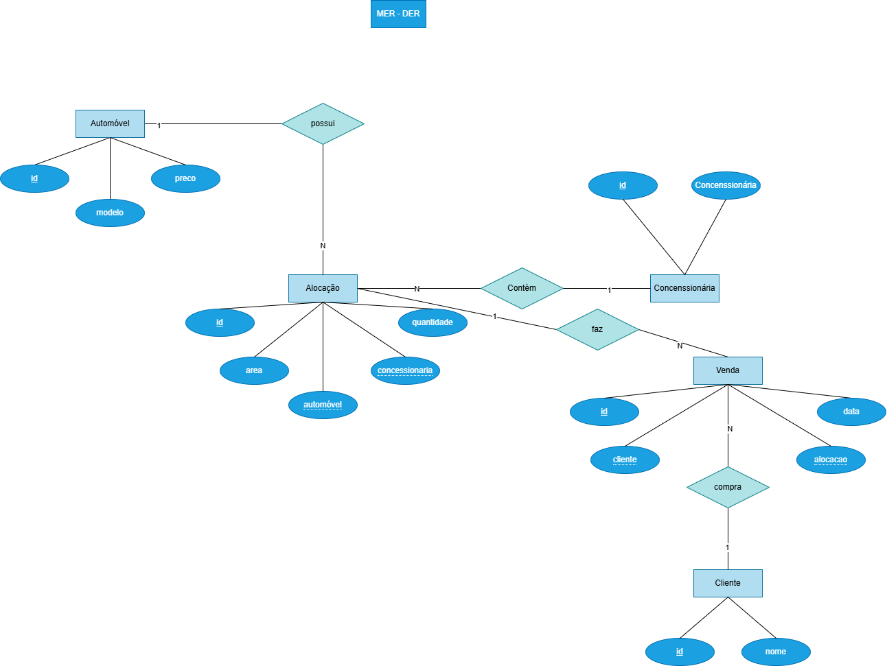

# fabricaautos2025

# Sistema de Concessionária

Sistema completo de gerenciamento para concessionárias com API Node.js e interface web.

## Como instalar?

### 1. Instalação
```bash
git clone <url-do-repositorio>
cd <nome-do-projeto>
npm install
```

### 2. Banco de Dados
Configure o arquivo `.env`:
```env
DATABASE_URL="mysql://root@localhost:3306/fabricaautomovel?schema=public&timezone=UTC"
```

Execute as migrações:
```bash
npx prisma migrate dev --name init
```

### 3. Executar Aplicação
```bash
npx nodemon server.js
```

## Estrutura
```
├── src/           # Código fonte da API
├── web/           # Interface front-end
├── docs/          # Documentação e dados CSV
└── prisma/        # Schema e configuração do banco
```

## API Endpoints
- `GET /clientes` - Listar clientes
- `POST /vendas` - Registrar venda
- `GET /automoveis` - Listar automóveis
- `GET /concessionarias` - Listar concessionárias

## Ferramentas
- Prisma ORM
- PostgreSQL
- Insomnia (coleção incluída)

A API estará em `http://localhost:3000`


## Diagrama de Casos de Uso (DCU)
<p align="center">
  
</p>

## Diagrama entidade relacionamento (DER)
<p align="center">
  
</p>

# Desenvolvido por

- Aluna: Beatriz Vizeu